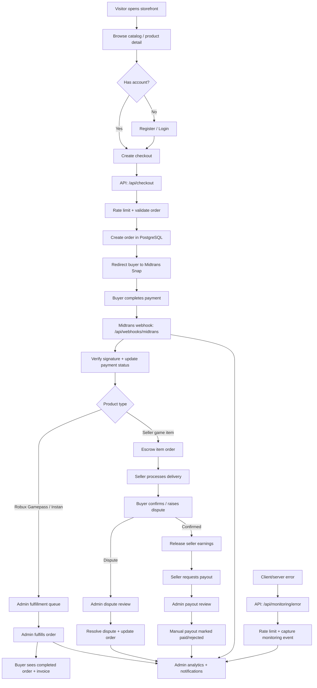
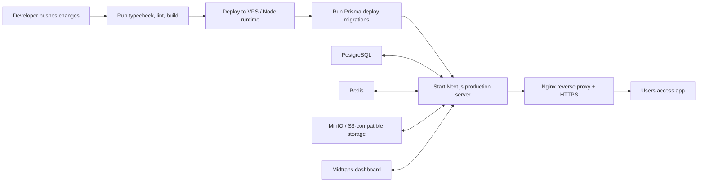

# ROLNUKS

A full-stack Roblox marketplace app built with Next.js. It covers Robux products, buyer checkout, admin fulfillment, seller onboarding, escrow, disputes, payouts, analytics, rate limiting, and basic error monitoring.

The vibe is simple: one app for selling Robux packages and game items, with admins handling Robux fulfillment and verified sellers listing their own game items.

## What's inside

- **Public storefront** for Robux Gamepass, Robux Instan, and game item products.
- **Auth** with credentials login/register powered by Auth.js / NextAuth v5.
- **Buyer dashboard** for profile, orders, invoice access, and support/dispute entry points.
- **Midtrans checkout** with Snap redirect and webhook handling.
- **Admin dashboard** for product management, order fulfillment, notifications, seller review, disputes, payouts, and analytics.
- **Seller flow** with seller application/KYC fields, seller product CRUD, earnings view, and order handling.
- **Escrow-style item flow** for seller-owned item products.
- **Manual payout ops** for seller withdrawals.
- **Rate limiting** on sensitive routes like login, register, checkout, webhook, and monitoring reports.
- **Error monitoring endpoint** for server/client error capture.
- **Docker local stack** for Postgres, Redis, and MinIO.

## Tech stack

- **Framework:** Next.js 16 App Router
- **Language:** TypeScript
- **UI:** React 19 + Tailwind CSS v4
- **Database:** PostgreSQL + Prisma 7
- **Auth:** Auth.js / NextAuth v5 credentials provider
- **Payments:** Midtrans Snap + webhook
- **Queue-ready deps:** BullMQ + ioredis
- **Storage-ready deps:** MinIO / S3-compatible config
- **Validation:** Zod
- **Logging:** Pino-ready setup

## Production app workflow

This is the high-level production flow for the marketplace. The app has three main actors: buyers, sellers, and admins. Payments go through Midtrans, while order fulfillment, escrow, disputes, payouts, analytics, and monitoring stay inside the app.



### Production operations flow



## Getting started

### 1. Install dependencies

```bash
npm install
```

### 2. Copy environment variables

```bash
cp .env.example .env
```

Fill in the values you need. For local development, the Docker Compose defaults are already reflected in the example env file.

Important env vars:

- `DATABASE_URL`
- `REDIS_URL`
- `AUTH_SECRET` or `NEXTAUTH_SECRET`
- `NEXTAUTH_URL`
- `MIDTRANS_SERVER_KEY`
- `MIDTRANS_CLIENT_KEY`
- `MIDTRANS_IS_PRODUCTION`
- S3/MinIO values if you use storage uploads

### 3. Start local infrastructure

```bash
npm run docker:up
```

This starts the local services needed by the app, mainly Postgres, Redis, and MinIO.

### 4. Generate Prisma client and migrate

```bash
npm run prisma:generate
npm run prisma:migrate -- --name init
```

### 5. Seed demo data

```bash
npm run prisma:seed
```

The seed script creates starter products and a default admin account.

Default local admin:

- Email: `admin@orblox.local`
- Password: `admin12345`

Please change this before deploying anywhere public.

### 6. Run dev server

```bash
npm run dev
```

Open:

```text
http://localhost:3000
```

## Production-style local run

Build it first:

```bash
npm run build
```

Then run:

```bash
npm run start
```

Or bind to all interfaces:

```bash
npm run start -- -H 0.0.0.0 -p 3000
```

## Useful scripts

- `npm run dev` — start the dev server.
- `npm run build` — create a production build.
- `npm run start` — serve the production build.
- `npm run lint` — run ESLint.
- `npm run lint:fix` — auto-fix lint issues.
- `npm run typecheck` — run TypeScript checks.
- `npm run format` — format code with Prettier.
- `npm run format:check` — check formatting.
- `npm run prisma:generate` — regenerate Prisma client.
- `npm run prisma:migrate` — run Prisma dev migrations.
- `npm run prisma:deploy` — apply migrations in production/CI.
- `npm run prisma:studio` — open Prisma Studio.
- `npm run prisma:seed` — seed local/demo data.
- `npm run db:reset` — reset local database.
- `npm run docker:up` — start local Docker services.
- `npm run docker:down` — stop local Docker services.
- `npm run docker:logs` — follow Docker service logs.

## Project structure

```text
prisma/
  schema.prisma       Database schema
  seed.ts             Demo catalog and admin seed
src/
  app/                Next.js app routes and pages
  components/         UI, forms, and layout components
  lib/                Shared helpers, db client, validators, monitoring, rate limit
  server/             Server actions and business services
  types/              Type augmentations
  auth.ts             Server-side Auth.js config
  auth.config.ts      Edge-safe auth config for proxy
  proxy.ts            Route protection and role gating
docker/               Local infra config
public/               Static assets
PLAN.md               Product and milestone spec
AGENTS.md             Developer/agent notes
```

## Main routes

Public:

- `/`
- `/katalog`
- `/katalog/[slug]`
- `/produk/[slug]`
- `/login`
- `/register`

Buyer:

- `/dashboard`
- `/dashboard/orders`
- `/dashboard/orders/[id]`
- `/dashboard/profile`
- `/dashboard/support`

Seller:

- `/dashboard/seller`
- `/dashboard/seller-apply`
- `/dashboard/seller/products`
- `/dashboard/seller/orders`
- `/dashboard/seller/earnings`

Admin:

- `/admin`
- `/admin/analytics`
- `/admin/produk`
- `/admin/orders`
- `/admin/sellers`
- `/admin/disputes`
- `/admin/payouts`
- `/admin/notifications`

API:

- `/api/auth/[...nextauth]`
- `/api/checkout`
- `/api/webhooks/midtrans`
- `/api/invoice/[orderId]`
- `/api/monitoring/error`

## Quality checks

Before pushing changes, run:

```bash
npm run typecheck
npm run lint
npm run build
```

All three should pass before deployment.

## Deployment notes

This app is designed for a VPS-style deployment with:

- Node.js 20+
- PostgreSQL
- Redis
- Nginx reverse proxy
- HTTPS via Let's Encrypt
- `npm run build` during deploy
- `npm run start -- -H 0.0.0.0 -p 3000` behind Nginx

For production, make sure to:

- Replace demo credentials.
- Use strong auth secrets.
- Use production Midtrans keys.
- Set correct callback/webhook URLs in Midtrans dashboard.
- Run Prisma migrations with `npm run prisma:deploy`.
- Configure backup jobs for Postgres.
- Add proper external logging/error monitoring if needed.

## Status

Current milestone coverage:

- M0 Foundation: done
- M1 Catalog and auth: done
- M2 Checkout and Midtrans: done
- M3 Admin fulfillment: done
- M4 Seller, item game, escrow, disputes: done
- M5 Payout, analytics, rate limiting, error monitoring: done
- M6 Hardening and launch: next up

## License

Private project. All rights reserved.
